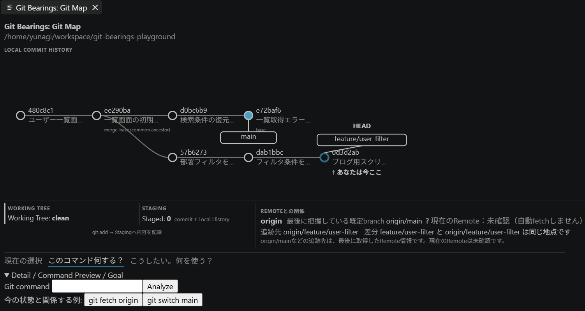

# Git Bearings

Git Bearingsは、実際のGit Repositoryを読み取り、「今どこにいるか」「ここまでどう来たか」「このGit commandで何が変わるか」を見える形にするVS Code拡張です。

Git操作そのものを代わりに実行するのではなく、HEAD、branch、Working Tree、Staging、Remoteの状態と、command実行後に起こりうる変化を分けて表示します。



## Install

現在はVS Code Marketplaceには公開していません。GitHub Releasesから `git-bearings-0.1.0.vsix` を取得してインストールしてください。

### VS Codeから入れる

1. GitHub Releasesから `git-bearings-0.1.0.vsix` をダウンロードします。
2. VS CodeのCommand Paletteで `Extensions: Install from VSIX...` を実行します。
3. ダウンロードしたVSIXを選択します。
4. 必要に応じて `Developer: Reload Window` を実行します。

### CLIから入れる

```sh
code --install-extension git-bearings-0.1.0.vsix
```

## まず使ってみる

1. Git RepositoryをVS Codeで開きます。
2. Command Paletteから `Git Bearings: 開く` を実行します。
3. 複数Repositoryがある場合は、表示したいRepositoryを選びます。
4. 必要に応じて `Git Bearings: 基準branchを選択` から比較対象のbranchを設定します。
5. Git MapでHEAD、branch、Commit Graph、Working Tree、Staging、Stash、Remoteの状態を確認します。
6. 「このコマンド何する？」にGit commandを入力すると、実行せずに状態変化をPreviewできます。
7. 「こうしたい。何を使う？」では、現在の状態に応じたcommand候補を確認できます。

## 主な機能

### 今どこ？

HEADとbranchがどのcommitを指しているか、Working TreeやStagingに何が残っているかを表示します。

### ここまでどう来た？

Commit Graphを左から右へ表示し、branch・HEAD・基準branchとの関係を見られます。merge-baseをbranch作成地点のように推測することはしません。

### このコマンド何する？

Git commandを実行せずに解析し、成功した場合の変化をPredictionとして重ねます。未来のcommit hashやlive Remoteの状態は作りません。

### こうしたい。何を使う？

「branchを切り替えたい」「変更をcommitしたい」などの目的から、現在のRepository状態に合うcommand候補を確認できます。ここからもcommandは実行されません。

### Fact / Prediction / Unknown

現在確認できている事実、command成功時の予測、現時点では分からないことを区別して表示します。

## Safety

Git Bearings自身はRepositoryを書き換えるGit commandを実行しません。Command PreviewやGoalに入力・表示されたcommandも解析用であり、Git Bearingsから実行されることはありません。

Git CLIの観測は厳格なcommand signature allowlistに限定し、shellを介さずargvとして実行します。auto-fetchや外部network通信は行わず、Git自身によるimplicit lazy fetchも無効化しています。partial clone、promisor remote、partial-clone用Remote設定を検出したRepositoryは、安全側に倒して現在は対象外とします。

Git commandのstdout / stderrにはbyte上限があります。Repository由来のbranch名、commit subject、path、stash messageなどにUnicode bidi制御文字が含まれる場合は、`[RLO]`や`[PDI]`のような可視マーカーへ変換して表示します。

Git BearingsはVS Codeが信頼済みとしたworkspaceでの利用を前提とし、Restricted Modeでは動作対象外です。敵対的な `.git` directoryそのものを安全な入力として保証するものではありません。Telemetryは実装していません。

## Command Previewの対応範囲

Previewは次の限定した構文を解析します。Git操作は実行しません。

- `git add <path...>` / `git add .`
- `git restore --staged <path...>`
- `git reset HEAD <path...>`
- `git commit` / `git commit -m <message>`
- `git switch <branch>` / `git switch -c <branch>`
- `git stash` / `git stash push`（`-u`、`-m`のみ）
- `git stash list`
- `git stash apply` / `git stash pop`（`stash@{n}`のみ）
- `git fetch [remote]`
- `git push` / `git push [-u] <remote> <branch>`
- `git pull [--rebase] [<remote> <branch>]`
- `git merge <branch>`
- `git rebase <upstream>`

これ以外のcommandやoptionは未対応です。shell演算子やshell展開を含む入力は解析しません。Goalから案内するRepository由来のbranch / remote等も、安全に表示できる限定した文字集合だけを対象とします。`git reset --hard`、force push、`git clean --force`などのhigh-risk操作はPreview対象外です。

## Supported environment / Known limitations

- VS Code `^1.93.0`
- Git 2.23以降
- 対象環境: Windows / macOS / Linux上のVS Code Desktop、WSL
- 手動の代表smokeは主にWindows / WSLで実施しています。全対象OSで同一範囲の手動確認を行った、という意味ではありません。
- Remote SSH / Dev ContainersはMVPの正式保証対象外です。
- partial clone / promisor remoteは対象外です。
- Command Previewは上記のcommand / optionだけを対象とします。
- Git BearingsはRemoteへ問い合わせないため、Remoteの最新状態が必要な箇所はUnknownになります。

## Development

```sh
npm ci
npm run compile
npm run check
npm test
```

VSIXを作る場合は次を実行します。

```sh
npx --yes @vscode/vsce package
```

設計と実装方針は [docs](docs/) を参照してください。

## License

MIT Licenseです。詳細は [LICENSE](LICENSE) を参照してください。
